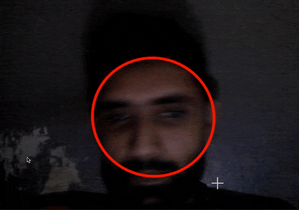

# Face-Tracker

A C++ Face Tracker using CamShift and OpenCV, for Windows. 




## Getting Started

It is just a two liner as all necessary details are encapsulated inside FaceTracker class. 

```
FaceTracker face_tracker;
face_tracker.StartCamShift( );
```

## Dependencies 

- It uses directshow so directshow paths must be set.
- It uses OpenCV so OpenCV must be configured.

## Possible Issues and Improvements

- I worked on it few years back so it is not up to date so it can definitely be improved and upgraded.
- At the time it was tested on Windows 7 and Windows 8 only.
